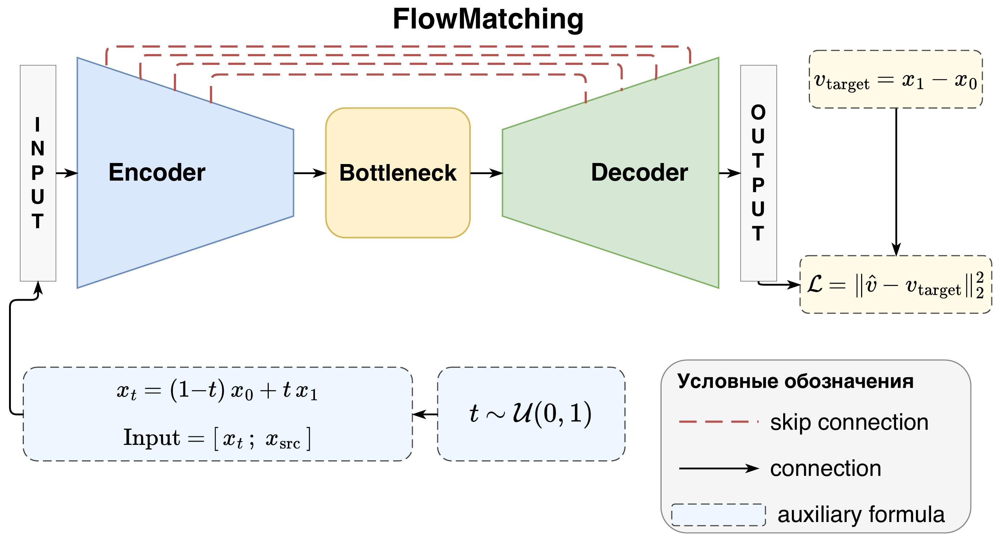
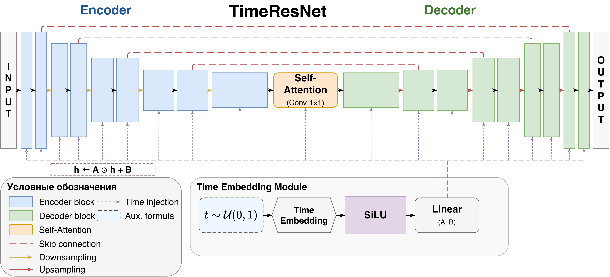
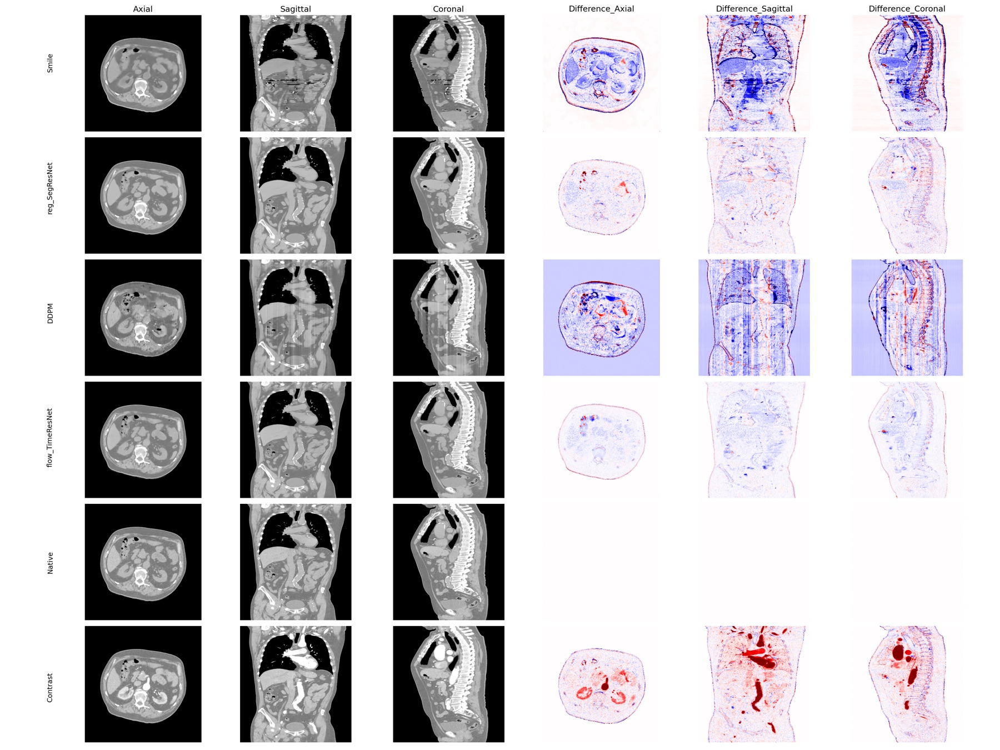

# Medical Flow Matching для трансляции компьютерных томограмм

[](https://huggingface.co/datasets/kreininmv/MS-Thesis)

**Выпускная квалификационная работа магистра**
Московский физико-технический институт (МФТИ)  
Факультет управления и прикладной математики, кафедра интеллектуального анализа данных  

**Автор:** М. В. Крейнин  
**Научный руководитель:** к. ф.-м. н. А. В. Грабовой

---

## Аннотация

Работа посвящена математической задаче двунаправленной трансляции между нативными и контрастными сериями компьютерных томограмм (КТ) брюшной полости средствами теории условного флоу матчинга. Предлагается фреймворк **Medical Flow Matching (MFM)** и нейросетевая параметризация поля скоростей **TimeResNet**. Метод обеспечивает одношаговый детерминированный инференс через интегрирование обыкновенного дифференциального уравнения и единственной сетью реализует оба направления трансляции $\pi_N \leftrightarrow \pi_C$.

---

## Схема метода

<p align="center">
  
</p>

Для пары $(\mathbf{x}_N, \mathbf{x}_C)$ строится линейный интерполянт $\mathbf{x}_t = (1-t)\mathbf{x}_N + t\mathbf{x}_C$, а сеть $f_\theta$ обучается предсказывать постоянную целевую скорость $\mathbf{v}^* = \mathbf{x}_C - \mathbf{x}_N$:

$$
\mathcal{L}_{\mathrm{FM}}(\theta) = \mathbb{E}_{t \sim \mathcal{U}[0,1]} \,\mathbb{E}_{(\mathbf{x}_N, \mathbf{x}_C) \sim \gamma} \bigl[ \lVert f_\theta(\mathbf{x}_t, t) - (\mathbf{x}_C - \mathbf{x}_N) \rVert_2^2 \bigr].
$$

При инференсе ОДУ $d\mathbf{x}_t/dt = f_\theta(\mathbf{x}_t, t)$ интегрируется за один шаг метода Эйлера: интегрирование от $t=0$ к $t=1$ даёт синтетический контраст, от $t=1$ к $t=0$ — синтетический нативный срез.

---

## Архитектура TimeResNet

<p align="center">
  
</p>

TimeResNet — U-Net энкодер-декодер с двумя специализированными модификациями.

1. **Поблочное аффинное внедрение времени.** Скаляр $t \in [0, 1]$ кодируется синусоидальным позиционным кодированием $\gamma(t)$, преобразуется двухслойным MLP с активацией SiLU и в каждом из $L$ ResNet-блоков модулирует скрытую активацию:

   $$
   \mathcal{M}_l(\mathbf{h}; t) = \mathbf{A}_l(t) \odot \mathbf{h} + \mathbf{B}_l(t), \qquad (\mathbf{A}_l, \mathbf{B}_l) = W_l \cdot \mathrm{MLP}(\gamma(t)).
   $$

   Это гарантирует ненулевую производную $\partial \mathcal{L}/\partial t$ на всех глубинах сети, в отличие от наивной конкатенации $t$ только со входом.

2. **Свёрточный модуль самовнимания на боттлнеке.** На самом грубом разрешении энкодера $H' \times W' = HW / 4^k$ свёртки $1 \times 1$ формируют $Q, K, V$, после чего применяется масштабированное скалярное произведение

   $$
   \mathrm{Attention}(Q, K, V) = \mathrm{softmax}\!\Bigl( \frac{Q K^\top}{\sqrt{C}} \Bigr) V
   $$

   с остаточным соединением. Стоимость $\mathcal{O}(N_{\mathrm{bottle}}^2 C)$ при $k = 4$ примерно в $4^{2k} \approx 65\,000$ раз меньше стоимости полноразмерного внимания.

---

## Основные результаты

### Качество трансляции (held-out, 20 пациентов)

**Контрастное → нативное.** MFM превосходит регрессионные базовые линии, диффузионный DDPM и SOTA SMILE по всем метрикам при сопоставимом числе параметров.

| Метод               | Модель           | MAE (HU)↓        | SSIM↑              | PSNR↑              | Время, с | Параметры, М |
|---------------------|------------------|------------------|--------------------|--------------------|----------|--------------|
| Регрессия           | SegResNet        | 6.33 ± 1.03      | 0.982 ± 0.007      | 38.46 ± 1.70       | 0.055    | 214.1        |
| Диффузия            | DDPM             | 18.20 ± 1.39     | 0.934 ± 0.008      | 30.05 ± 1.48       | 44.20    | 124.7        |
| SOTA                | SMILE            | 30.22 ± 4.95     | 0.887 ± 0.026      | 26.70 ± 1.33       | 9.03     | 1066         |
| **Флоу матчинг**    | **TimeResNet**   | **4.25 ± 1.09**  | **0.994 ± 0.007**  | **42.19 ± 1.67**   | 0.125    | 124.7        |

$$
\frac{\mathrm{MAE}_{\mathrm{SMILE}}}{\mathrm{MAE}_{\mathrm{TimeResNet}}} \approx 7.1, \qquad \frac{T_{\mathrm{DDPM}}}{T_{\mathrm{TimeResNet}}} \approx 354.
$$

**Нативное → контрастное (та же сеть, без переобучения).**

| Модель          | MAE (HU)↓        | SSIM↑              | PSNR↑            |
|-----------------|------------------|--------------------|------------------|
| SMILE           | 21.70 ± 4.26     | 0.903 ± 0.019      | 29.28 ± 1.53     |
| SegResNet       | 6.82 ± 0.82      | 0.983 ± 0.004      | 37.82 ± 1.46     |
| **TimeResNet**  | **4.57 ± 0.87**  | **0.996 ± 0.004**  | **41.52 ± 1.53** |

### Качественное сравнение

<p align="center">
  
</p>

Сверху вниз: SegResNet, DDPM, MFM, эталон (нативный), вход (контрастный). Справа — карты абсолютных отклонений в HU. MFM сохраняет анатомическую структуру и тканевые границы; карты разностей у MFM равномерно тёмные, что отражает превосходство по MAE и SSIM.

### Абляция компонентов TimeResNet

| Вариант                                       | MAE (HU)↓        | SSIM↑              | PSNR↑            |
|-----------------------------------------------|------------------|--------------------|------------------|
| TimeResNet (полная архитектура)               | **4.25 ± 1.09**  | **0.994 ± 0.007**  | **42.19 ± 1.67** |
| без свёрточного самовнимания                  | 5.96 ± 1.01      | 0.985 ± 0.007      | 39.84 ± 1.66     |
| без поблочного внедрения времени              | 6.02 ± 1.01      | 0.987 ± 0.007      | 39.96 ± 1.71     |
| без обоих компонентов                         | 6.67 ± 1.07      | 0.981 ± 0.007      | 38.52 ± 1.65     |

Каждый из предложенных компонентов вносит сопоставимый вклад в MAE ($\approx 1.7$ HU).

### Downstream-сегментация (nnUNet v2, аорта)

| Обучающие данные                  | Dice ↑    |
|-----------------------------------|-----------|
| Реальные нативные                 | 0.966     |
| Синтетические нативные (MFM)      | **0.926** |

Разрыв в 4.0 процентных пункта (95.9% от базового уровня) показывает применимость синтезированных данных для обучения сегментационных моделей.

---

## Данные

| Параметр                | Значение                                                  |
|-------------------------|-----------------------------------------------------------|
| Объём                   | 120 исследований брюшной полости (52 561 срез), 3 клиники |
| Парность                | нативная + артериальная фазы одного пациента              |
| Разбиение               | 80 / 20 / 20 (обучение / тест / held-out)                 |
| Размер срезов           | 512 × 512                                                 |
| Диапазон HU             | $[-1000, 1000] \to [-1, 1]$                               |
| Регистрация             | ANTs SyN с маской тела                                    |

**Аугментация (MONAI):** отражения по осям $x$/$y$ (50%), повороты на $90^\circ k$, $k \in \{1, 2, 3\}$ (50%), аффинные преобразования (70%; поворот $\pm 45^\circ$, сдвиг $\pm 102.4$ пкс, срезание $\pm 10^\circ$). Интенсивностные аугментации исключены, поскольку нарушают соответствие в шкале HU.

---

## Структура репозитория

```
.
├── paper/
│   └── diploma/                # LaTeX-источники ВКР
│       ├── main.tex
│       ├── sections/           # Разделы текста
│       ├── pictures/           # Рисунки (flow, timeresnet, ...)
│       ├── references.bib
│       └── main.pdf
│
├── slides/                     # Презентация (Beamer)
│   ├── slides.tex
│   ├── images/                 # Рисунки слайдов
│   └── slides.pdf
│
├── src/                        # Реализация и эксперименты
│   ├── configs/                # YAML-конфигурации моделей
│   ├── models/                 # Реализации архитектур
│   ├── training/               # Тренеры (flow / regression / diffusion)
│   ├── validation/             # Скрипты валидации (Python + bash)
│   ├── notebooks/              # Jupyter-ноутбуки запуска и визуализации
│   ├── logs/                   # Кривые потерь обучения (JSON)
│   ├── images/                 # Сгенерированные фигуры
│   ├── results/
│   │   ├── flow_matching/      # Метрики моделей флоу матчинга
│   │   └── regression/         # Метрики регрессионных базовых линий
│   └── README.md
│
└── README.md                   # Настоящий файл
```

---

## Воспроизведение результатов

### Требования

- Python 3.10 или выше
- PyTorch 2.0 или выше
- MONAI 1.3 или выше
- `dynamic-network-architectures`, `mamba-ssm` (для UMambaBot; требуется совместимая версия CUDA)
- TotalSegmentator (для перцептивной метрики TotalSeg-LPIPS)
- Дополнительно: `numpy`, `matplotlib`, `tqdm`, `nibabel`, `ants`

### Обучение

Все модели обучаются 30 эпох оптимизатором Adam (lr $= 2 \times 10^{-5}$, $\beta_1 = 0.9$, $\beta_2 = 0.999$, batch $= 2$) на четырёх NVIDIA RTX 3090. Пример запуска:

```python
from src.training.flow_matching import FlowTrainer

trainer = FlowTrainer("src/configs/flow_match_mynet.yaml")
trainer.fit()
```

### Валидация

```bash
# Все модели флоу матчинга (multi-GPU, 6 численных схем: Euler 1/2/3, RK2, RK4, Midpoint)
bash src/validation/run_validation.sh

# Регрессионные базовые модели
bash src/validation/run_validation_regression.sh

# Агрегация по-пациентных результатов в summary.json
python src/validation/validate_flow_models.py --aggregate
python src/validation/validate_regression_models.py --aggregate
```

Подробное описание конфигураций, моделей и форматов результатов приведено в [src/README.md](src/README.md).

---

## Положения, выносимые на защиту

1. Фреймворк **Medical Flow Matching**: $\theta^* = \arg\min_\theta \mathcal{L}_{\mathrm{FM}}(\theta)$ с линейным интерполянтом — математическая формализация задачи переноса меры $\pi_N \leftrightarrow \pi_C$.

2. **Утверждение о двунаправленности**: $f_{\theta^*} = \arg\min_f \bigl[\mathcal{L}_{\mathrm{FM}}^{N\to C}(f) + \mathcal{L}_{\mathrm{FM}}^{C\to N}(f)\bigr]$ — единственная сеть реализует оба направления без переобучения.

3. Архитектура **TimeResNet** с теоретически обоснованными компонентами:
   - **сохранение временно́го сигнала**: при $\mathcal{M}_l(\mathbf{h}; t) = \mathbf{A}_l(t)\odot\mathbf{h} + \mathbf{B}_l(t)$ выполнено $\partial \mathcal{L}/\partial t \neq 0$ на всех глубинах $l = 1, \ldots, L$;
   - **сложность боттлнекового self-attention**: $\mathcal{O}(N_{\mathrm{bottle}}^2 C)$, в $4^{2k}$ раз дешевле полноразмерного.

4. **Утверждение об одношаговом инференсе**: при линейном интерполянте ускорение траектории $C_2 = 0$, поэтому глобальная ошибка Эйлера $e_N \le (\delta/L)(e^L - 1)$ определяется лишь качеством аппроксимации сетью.

---

## Цитирование

```bibtex
@mastersthesis{kreinin2026mfm,
  title  = {Medical Flow Matching для трансляции компьютерных томограмм},
  author = {Крейнин, М.\,В.},
  school = {Московский физико-технический институт},
  year   = {2026},
  type   = {Магистерская диссертация},
  url    = {https://github.com/kreininmv/Kreinin-MS-Thesis}
}
```

---

## Контакты

- **Автор:** Крейнин Матвей Викторович — `kreinin.mv@phystech.edu`
- **Научный руководитель:** Грабовой Андрей Валериевич
